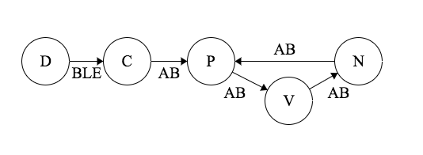

# ble-remote-control

[Bluetooth Low Energy (BLE)][0] remote control for [Spotify][1] on **macOS** with [Node.js][2] and [AppleScript][3]. This script raise a custom event over [BLE][0] when the [micro:bit][4] buttons ared pressed. Users can perform several actions like play or pause tracks, turn volume up or down and go to next or previous track.

Although this script is using [BLE][0] there is no need to pair your [micro:bit][4] with your Apple device. In order to get this, the `pxt.json` file has been configured as follows. The property of the bluetooth json object called `open` has been configured with a value of `1` which means *no security*.

```json
"yotta": {
    "config": {
        "microbit-dal": {
            "bluetooth": {
                "open": 1
            }
        }
    }
}
```

## How to build an deploy the project

1. Install [node.js][2].

2. Install the PXT [(Microsoft Programming Experience Toolkit)][6] command line tool with `npm`.

```
npm install -g pxt
```

3. Clone this repository to your computer.

```
git clone TODO
cd microbit-ble-rc-spotify
cd ble-remote-control
```

4. Install the [micro:bit][4] target for PXT. This target allows you to program a [micro:bit][4] using PXT.

```
pxt target microbit
```

5. Install the required PXT packages for this project (`core` and `bluetooth`). The dependencies of the project are defined in `pxt.json`.

```
pxt install
```

6. Connect the [micro:bit][4] to your computer via USB.

7. To build and deploy the project, execute `pxt` with no arguments or run `make`. Doing this, PXT will compile and link the code into an `.hex` file and will deploy it into your connected [micro:bit][4].

```
pxt
```

When you run the `pxt` command, you will see a similar message to this:

```
Using target PXT/microbit with build engine yotta
  Target dir:   /microbit-ble-rc-spotify/node_modules/pxt-microbit
  PXT Core dir: /microbit-ble-rc-spotify/node_modules/pxt-core
running 'pxt deploy' (run 'pxt help' for usage)
Package built; written to binary.hex; size: 605847
copying binary.hex to /Volumes/MICROBIT/
   wrote hex file to /Volumes/MICROBIT/
```

Now, your [micro:bit][4] device is ready to work as a remote control for [Spotify][1] on **macOS** with [Node.js][2] and [AppleScript][3]. The next step is to run the `ble-event-listener` script to listen to the custom events raised by the BBC micro:bit over [BLE][0].

## How it works

### States

The [micro:bit][4] device can be in one of a finite number of states at any given time. The list of available states are the following:

|  Symbol |     State   |  Description |
|---------|-------------|--------------|
| **D**  | Disconnected | The [micro:bit][4] device is **not connected** with the computer via [BLE][0].        |
| **C**  | Connected | The [micro:bit][4] device is **connected** with the computer via [BLE][0].
| **P**  | Play | The [micro:bit][4] device is ready to play or pause a track.
| **V**  | Volume | The [micro:bit][4] device is ready to turn volume up or down.
| **N**  | Next | The [micro:bit][4] device is ready to go to next or previous track.

### Inputs

The state machine can change from one state to another in response to external inputs. In our project there are two possible inputs:

| Input |      Description |
|-------|------------------|
| **BLE** | When the [micro:bit][4] establishes a [BLE][0] connection with a computer. |
| **AB**  | When the [micro:bit][4] buttons `A` and `B` are pressed together. |

### Transitions

The change from one state to another is called a transition.

### State machine diagram

The state diagram for the project can be modeled as follows:



Where each state is represented by a node (circle) and the edges (arrows) show the transitions from one state to another. Each arrow is labeled with the input that triggers that transition.

## Remote Control

The actions that users can perform to control [Spotify][1] via [BLE][0] are:

* Play or pause tracks.
* Turn volume up or down.
* Go to next or previous track.

To run these actions the [micro:bit][4] device needs to be in one of these states: 

* **P** (Play).
* **V** (Volume).
* **N** (Next).

When the [micro:bit][4] is in one of these states the user can press the `A` or `B` buttons in order to raise a custom event to control [Spotify][1]. This table shows what are the different possibilities that an user can perform.

|  Input \ State | **P** | **V** | **N** |
|--------|-------|-------|-------|-------|
| **Press `A` button**  | Play or pause track | Turn volume up | Go previous track |
| **Press `B` button**  |  | Turn volume down | Go next track |

## References

* [How to switch off the need to pair your micro:bit when using Bluetooth](http://bluetooth-mdw.blogspot.com/2016/08/how-to-switch-off-need-to-pair-your.html). Martin Woolley.
* [Finite-state machine](https://en.wikipedia.org/wiki/Finite-state_machine). Wikipedia.

## Author

Developed by [José Juan Sánchez][5].

## License

```
Licensed under the GNU General Public License, Version 3 (the "License");
you may not use this file except in compliance with the License.
You may obtain a copy of the License at

   http://www.gnu.org/licenses/gpl-3.0.en.html

Unless required by applicable law or agreed to in writing, software
distributed under the License is distributed on an "AS IS" BASIS,
WITHOUT WARRANTIES OR CONDITIONS OF ANY KIND, either express or implied.
See the License for the specific language governing permissions and
limitations under the License.
```

[0]: https://en.wikipedia.org/wiki/Bluetooth_Low_Energy
[1]: https://www.spotify.com
[2]: https://nodejs.org
[3]: https://www.npmjs.com/package/spotify-node-applescript
[4]: https://microbit.org
[5]: http://josejuansanchez.org
[6]: https://github.com/Microsoft/pxt